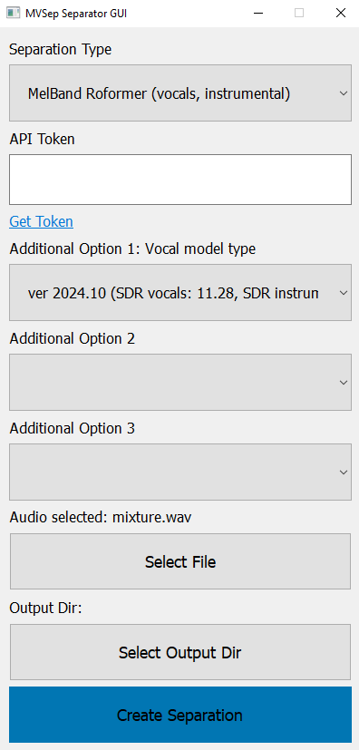

# MVSep API Examples

Repository with examples of API usage for site [https://mvsep.com](https://mvsep.com). Full API documentation is available [here](https://mvsep.com/en/full_api). 

## Python examples

### Example 1

[api_example.py](python_example1/api_example.py) - console example with 3 different methods: 
* `get_types` - get list of all possible types of separation
* `create_separation` - create separation task with given parameters
* `get_result` - get result of separation. It's called manually.

[Detailed description →](python_example1/README.md)

### Example 2

In this example you provide path to folder, which contains audio-files. Script process each file one by one and automatically download all separated files when they're ready. It can be slow for free MVSep account.

[api_example2.py](python_example2/api_example2.py) - console example with 2 different methods: 
* `get_types` - get list of all possible types of separation
* `separate` - create separation task with given parameters

[Detailed description →](python_example2/README.md)

### Example 3

This example uses `MVSEPClient` class to create separations. It also automatically separate many files at once and download them after finish. Initial version proposed by [@jarredou](https://github.com/jarredou).

[mvsep_client.py](python_example3/mvsep_client.py)
* `get_types` - get list of all possible types of separation
* `separate` - create separation task with given parameters

[Detailed description →](python_example3/README.md)

### Example 4

Simple GUI for creating separation using MVSep API. You can run it with 2 methods:
1) `python3 mvsep_client_gui.py`
2) `mvsep_client_gui_win.exe` - binary file for Windows 10/11 you can run directly without python installed.

#### Interface

<kbd></kbd>

### Example 5

Complex GUI for creating separation using MVSep API. It allows to add multiple files for separation as well as multiple algorithms. You can run it with 2 methods:
1) `python3 mvsep_client_gui.py`
2) `mvsep_client_gui_win.exe` - binary file for Windows 10/11 you can run directly without python installed.

#### Interface

<kbd></kbd>