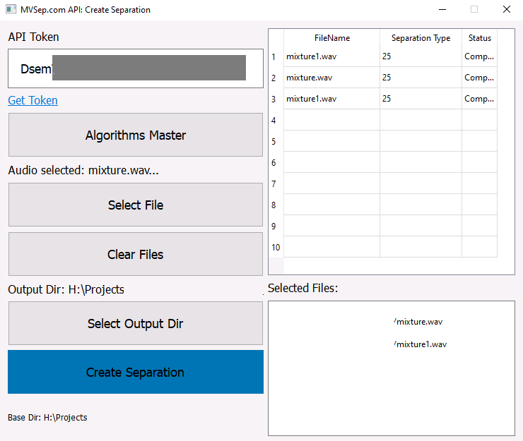

# Project: GUI for Interaction with MVSep.com Website

This document serves as a user guide for utilizing the graphical user interface (GUI) specifically designed for interacting with the MVSep.com website. The interface allows users to upload files, choose processing algorithms, and track operation statuses. We will explore the project structure, its core components, and steps for configuration and launching the application.

## Overview of Application

The application is built using the PyQt6 framework, which is widely used for developing desktop applications with graphical interfaces. Its primary goal is to simplify the process of uploading audio files and configuring various sound-processing algorithms. This significantly enhances user interaction with MVSep.com by enabling efficient handling of large datasets and faster results delivery.

### Interface 

<kbd></kbd>

## Key Features

1. **File Upload:**
   Users can select one or multiple audio files for further processing. Supported formats include MP3 and WAV. Users have the ability to directly drag and drop files into the application window or use their operating system's standard file selection dialog.

2. **Algorithm Selection:**
   A convenient wizard provides options for selecting different sound signal processing algorithms. Available choices include instrument separation, noise reduction, and quality enhancement. Each algorithm comes with advanced settings that allow customization tailored to specific needs.

3. **Multi-algorithm Processing:**
   The interface supports simultaneous processing of a single file through multiple algorithms, ensuring flexibility and ease when working with diverse scenarios involving sound signal processing.

4. **Process Monitoring:**
   Operation statuses are displayed in real-time via a dedicated table. Users can monitor each stage of every file being processed, starting from initial loading up until final completion.

5. **Thread Utilization (QThread):**
   The application leverages multithreading, providing smooth performance even during heavy processing tasks. Each thread tracks individual task progress, updating state information within the status table dynamically.

## Installation and Launch

To launch the application, simply execute the executable file `MVSepApp.exe`. This eliminates the need for installing all required dependencies onto the user's device.

## Application Architecture

The project consists of several essential components:

- **MainWindow:** The main application window implemented by the `MainWindow` class.
- **SepThread:** A thread class responsible for monitoring process states.
- **DragButton:** Button supporting drag-and-drop functionality for file transfers.
- **Database:** An SQLite database storing operational history and current assignments.

### Class MainWindow
The core component of the application contains widgets such as tables, buttons for file selection, and algorithm setup. It implements logic for managing program state and visualizing user actions.

### Class SepThread
A subclass of `QThread` designed for tracking and updating process statuses. It polls servers periodically and updates both the database and user interface accordingly.

### Basic Logic of the Application
Upon startup, the application establishes a connection to an SQLite database where tasks and log entries are stored. When a user selects a file and clicks “Create Separation,” a record is created in the database, initiating the file processing workflow.

## Implementation Highlights

### Use of Threads
One significant feature of this application is its utilization of threads (`QThread`) for parallel file processing. This ensures seamless operation even under extended processing operations.

Each thread regularly queries server-side task statuses and updates corresponding rows in the status table, allowing users to view real-time progress across all active processes.

## Data Storage
All completed operations are recorded in a local SQLite database. This storage retains critical details including:

- Unique task identifier.
- Name of the processed file.
- Selected processing type.
- Current task status.
- Additional metadata related to status changes.

This architecture helps users manage ongoing tasks efficiently and review past activities easily.

## Graphical User Interface
The GUI is developed using the PyQt6 libraries. Elements of the user interface include:

- Input field for entering a user token (with a link provided below it for authenticated users who haven't obtained a token yet).
- Table displaying the current status of tasks.
- Buttons for file selection and initiation of processing.
- Wizard for choosing algorithms and setting them up.
- Directory selector button specifying output directories for saved separations.
- Display of already-selected files and algorithms to enhance usability.
- Clearing options for removing previously chosen files or algorithms when needed.
